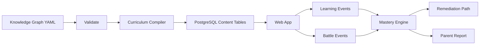

# 系统架构

## 1. 架构原则

- MVP 使用模块化单体，不提前拆微服务。
- 知识图谱先以 Git 管理的 YAML 为源，发布时导入数据库。
- 战斗状态由服务端裁决，客户端负责表现和本地容错。
- 题目版本不可变，进行中的战斗固定版本。
- 内容、学习、战斗和掌握度领域边界清晰。
- 所有关键行为可追踪、可复盘、可回放。

## 2. 推荐初始技术栈

| 区域 | 推荐 |
|---|---|
| 语言 | TypeScript |
| Web 客户端 | Next.js + React |
| 移动端 | 先做响应式 PWA，后续评估 React Native |
| API | Fastify 或 NestJS |
| 数据库 | PostgreSQL |
| ORM | Prisma 或 Drizzle |
| 缓存和队列 | Redis + BullMQ |
| 对象存储 | S3 兼容存储 |
| 内容后台 | Next.js 管理端 |
| 事件分析 | PostHog，后续接 ClickHouse |
| 部署 | Docker + 托管容器平台 |
| CI | GitHub Actions |

最终选型需要在工程启动前单独记录 ADR。

## 3. 仓库结构

```text
KnowGate/
  apps/
    web/
    api/
    admin/
  packages/
    domain/
    contracts/
    content-tools/
    ui/
  docs/
  content/
    knowledge-graphs/
    chapters/
    items/
    bosses/
```

`packages/domain` 只放领域类型和纯逻辑，不依赖数据库或框架。

`packages/contracts` 放 API 请求、响应和事件 Schema。

`packages/content-tools` 放知识图谱校验、课程编排、题目生成和导入工具。

## 4. 运行模块

### Identity

- 用户和监护人。
- 登录。
- 角色和权限。
- 数据同意和隐私设置。

### Content

- 学科、领域、节点。
- 章节、题目、Boss。
- 内容版本。
- 来源和许可证。

### Learning

- 年级世界。
- 小关。
- 章节进度。
- 知识和节点掌握度。

### Battle

- Boss 定义。
- 战斗会话。
- 题目下发。
- 答案裁决。
- 连击、伤害和失败推进。

### Mastery

- 节点掌握度。
- 前置依赖校验。
- 补课路径。
- 延迟复习。

### Analytics

- 学习行为。
- 战斗行为。
- 内容质量。
- 留存和学习增益。

## 5. 数据流



## 6. 战斗服务

服务端负责：

- 创建战斗。
- 冻结题目版本。
- 下发当前题目。
- 接收答案。
- 裁决答案。
- 结算伤害、连击和 Boss 前进。
- 判断胜负。
- 写入幂等事件。
- 恢复未完成战斗。

客户端负责：

- 倒计时表现。
- 答案输入。
- 动画和音效。
- 断网时本地排队。
- 恢复服务端状态。

客户端不能自行决定最终胜负。

## 7. 内容发布

发布流程：

1. 内容作者提交 YAML 或后台草稿。
2. CI 校验语法、ID、依赖、版本和来源。
3. 教师审核。
4. 编排器生成年级世界、小关和章节。
5. 内容发布服务写入数据库。
6. 发布快照记录版本号。
7. 客户端获取稳定版本或灰度版本。

## 8. 缓存

- 知识图谱和课程结构使用 CDN 或只读缓存。
- 用户掌握度不进入共享缓存。
- 战斗状态写入数据库，Redis 只用于短期锁和队列。
- 静态媒体走对象存储和 CDN。

## 9. 可观测性

必须记录：

- 请求 ID。
- 用户 ID 的不可逆匿名标识。
- 内容版本。
- 战斗 ID。
- 题目版本。
- 裁决结果。
- 延迟和错误。

关键指标：

- API 延迟。
- 战斗创建成功率。
- 答案提交成功率。
- 断线恢复成功率。
- 内容发布失败率。
- 题目异常率。

## 10. 安全与隐私

- 未成年用户默认最小化收集。
- 家长和教师权限分离。
- 敏感数据加密存储。
- 日志不记录明文答案之外的隐私信息。
- 管理后台启用 MFA。
- 内容下载和导出需要审计。

